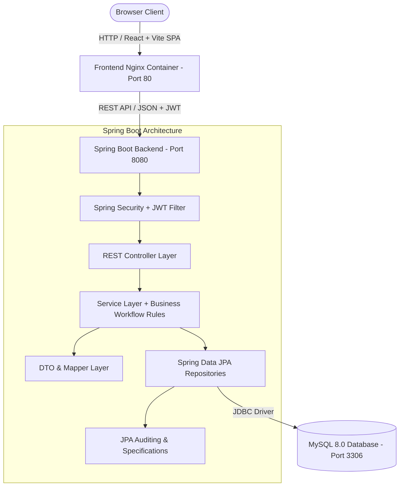

# Employee Management & Task Tracking System

[](https://www.oracle.com/java/)
[](https://spring.io/projects/spring-boot)
[](https://spring.io/projects/spring-security)
[](https://reactjs.org/)
[](https://www.mysql.com/)
[](https://www.docker.com/)

A production-style, portfolio-grade Full Stack web platform for enterprise workforce management, role-based authorization, task assignment, status workflow tracking, and real-time dashboard analytics.

---

## 🏛 Architecture Diagram



---

## ✨ Features

### 🔐 Authentication & Security
- **JWT Stateless Authentication**: Secure token generation via HMAC-SHA256 (`jjwt 0.12.6`).
- **BCrypt Password Hashing**: Passwords stored securely using BCrypt cost factor 10.
- **Role-Based Authorization**: Strict endpoint protection distinguishing `ROLE_ADMIN` and `ROLE_EMPLOYEE`.
- **Protected React Routes**: Client-side route guards enforcing JWT validation and role requirements.

### 👥 Employee Management (Admin)
- **Employee Lifecycle**: Create, view, update, and deactivate employee profiles.
- **Linked Account Generation**: Automatic `User` entity creation with linked `Employee` profile.
- **Paginated Directory**: Server-side pagination (`Pageable`), multi-field search (first name, last name, email), and department filtering.

### 📋 Task Management & Workflow
- **Task Assignment**: Admin creates tasks with priority (`LOW`, `MEDIUM`, `HIGH`, `URGENT`) and assigns to active employees.
- **Status Workflow State Machine**: Controlled transitions (`TODO` ➔ `IN_PROGRESS` ➔ `COMPLETED` / `CANCELLED`).
- **Employee Task Board**: Dedicated "My Assigned Tasks" view enabling employees to update task progress.

### 📊 Real-Time Analytics Dashboards
- **Admin Dashboard**: System-wide employee counts, active workforce ratio, task breakdown by status and priority.
- **Employee Dashboard**: Workload metrics, assigned task counts, and upcoming deadlines within 7 days.

### 🛠 Quality & Engineering Standards
- **Global Exception Handling**: Centralized `@RestControllerAdvice` handling custom exceptions (`ResourceNotFoundException`, `DuplicateResourceException`, `InvalidTaskStatusException`, `UnauthorizedAccessException`).
- **OpenAPI / Swagger**: Interactive API testing playground at `/swagger-ui.html`.
- **Comprehensive Unit Testing**: JUnit 5 & Mockito test suite covering business logic and authorization.
- **Docker Compose Orchestration**: Multi-container setup for MySQL, Spring Boot, and React + Nginx.

---

## 🧰 Technology Stack

| Layer | Technology |
| :--- | :--- |
| **Backend Framework** | Java 17/21, Spring Boot 3.3.5, Spring Web, Spring Data JPA |
| **Security** | Spring Security 6, JWT (`jjwt 0.12.6`), BCrypt Encoder |
| **Database & Persistence**| MySQL 8.0, Hibernate ORM, H2 (Testing) |
| **Frontend Framework** | React.js 18, Vite, React Router v6, Axios |
| **Styling & UI** | Modern Vanilla CSS Design Tokens, Lucide Icons |
| **DevOps & Containers** | Docker, Docker Multi-stage Builds, Docker Compose, Nginx |
| **API Documentation** | OpenAPI 3.0 / Swagger UI (`springdoc-openapi`) |
| **Testing** | JUnit 5, Mockito, Spring Security Test |

---

## 🗄 Database Schema & Indexing Rationale

```mermaid
erdiagram
    USERS ||--|| EMPLOYEES : "1-to-1 (user_id FK)"
    EMPLOYEES ||--o{ TASKS : "1-to-many (assigned_employee_id FK)"

    USERS {
        bigint id PK
        varchar email UK
        varchar password
        enum role "ADMIN, EMPLOYEE"
        boolean enabled
        datetime created_at
        datetime updated_at
    }

    EMPLOYEES {
        bigint id PK
        bigint user_id FK,UK
        varchar first_name
        varchar last_name
        varchar email UK
        varchar phone
        varchar department
        varchar designation
        date joining_date
        boolean active
        datetime created_at
        datetime updated_at
    }

    TASKS {
        bigint id PK
        varchar title
        text description
        bigint assigned_employee_id FK
        enum priority "LOW, MEDIUM, HIGH, URGENT"
        enum status "TODO, IN_PROGRESS, COMPLETED, CANCELLED"
        date due_date
        datetime created_at
        datetime updated_at
    }
```

### Strategic Database Indexes
- `idx_users_email` on `users(email)`: Optimized $O(1)$ user lookup during login authentication.
- `idx_employees_department` on `employees(department)`: Fast filtered queries on employee directory.
- `idx_employees_active` on `employees(active)`: Instant filtering of active workforce.
- `idx_tasks_assigned_employee` on `tasks(assigned_employee_id)`: Fast retrieval of "My Tasks".
- `idx_tasks_status` & `idx_tasks_priority`: Accelerates real-time dashboard aggregation queries.

---

## 📡 REST API Endpoint Catalog

### 🔐 Authentication
- `POST /api/auth/login` - Authenticate user credentials and return JWT bearer token.

### 👥 Employee Management
- `GET /api/employees` - Get paginated employees (Supports `search`, `department`, `active`, `page`, `size`).
- `GET /api/employees/{id}` - Get employee details by ID.
- `GET /api/employees/me` - Get currently authenticated employee profile.
- `POST /api/employees` - Create employee & linked user account *(Admin Only)*.
- `PUT /api/employees/{id}` - Update employee details *(Admin Only)*.
- `PATCH /api/employees/{id}/deactivate` - Deactivate employee account *(Admin Only)*.

### 📋 Task Management
- `GET /api/tasks` - Get all tasks with filters *(Admin Only)*.
- `GET /api/tasks/my` - Get assigned tasks for logged-in employee.
- `GET /api/tasks/{id}` - Get task details by ID.
- `POST /api/tasks` - Create task and assign to employee *(Admin Only)*.
- `PUT /api/tasks/{id}` - Update task details *(Admin Only)*.
- `PATCH /api/tasks/{id}/status` - Update task status *(Employee / Admin)*.
- `DELETE /api/tasks/{id}` - Delete task *(Admin Only)*.

### 📊 Dashboard
- `GET /api/dashboard/admin` - System metrics & task distribution *(Admin Only)*.
- `GET /api/dashboard/employee` - Personal workload metrics & upcoming deadlines.

---

## 🚀 Running the Application

### 🔑 Demo Credentials
Upon initial startup, the system automatically populates seed accounts:
- **Admin Account**: Email `admin@company.com` | Password `Admin@123`
- **Employee Account**: Email `john.doe@company.com` | Password `Password@123`

---

### Option 1: Running with Docker Compose (Recommended)

1. **Clone the repository**:
   ```bash
   git clone https://github.com/your-username/employee-management-system.git
   cd employee-management-system
   ```

2. **Launch all containers**:
   ```bash
   docker compose up --build
   ```

3. **Access Applications**:
   - **React Frontend**: [http://localhost](http://localhost)
   - **Spring Boot REST API**: [http://localhost:8080/api](http://localhost:8080/api)
   - **Swagger OpenAPI Docs**: [http://localhost:8080/swagger-ui.html](http://localhost:8080/swagger-ui.html)

---

### Option 2: Running Locally (Development Mode)

#### 1. Backend (Spring Boot)
Ensure MySQL is running on port 3306 with database `employee_management`.
```bash
cd backend
./mvnw clean spring-boot:run
```

#### 2. Running Unit Tests
```bash
cd backend
./mvnw test -Dspring.profiles.active=test
```

#### 3. Frontend (React + Vite)
```bash
cd frontend
npm install
npm run dev
```
Access frontend at [http://localhost:3000](http://localhost:3000).

---

## 🎯 Interview Q&A Reference Guide

### 1. Why did you choose layered architecture (Controller-Service-Repository)?
> Separating concerns improves maintainability and testability. Controllers handle HTTP request validation and mapping, Services encapsulate business rules and transactional logic, and Repositories isolate persistence operations.

### 2. How does JWT authentication work in Spring Security?
> When a user logs in, Spring Security authenticates credentials using `AuthenticationManager`. Upon success, `JwtTokenProvider` generates a signed HMAC-SHA256 JWT containing user claims. For subsequent requests, `JwtAuthenticationFilter` intercepts the `Authorization: Bearer <token>` header, parses claims, loads `UserDetails`, and populates `SecurityContextHolder`.

### 3. Why did you use DTOs instead of exposing JPA Entities?
> Exposing JPA entities directly causes security risks (exposing password hashes), performance issues (N+1 queries), and serialization errors (circular JSON references with `@OneToMany` relationships). DTOs provide clean, decoupled API contracts.

### 4. How did you handle CORS and security headers?
> Spring Security `CorsConfigurationSource` is configured to allow explicit frontend origins and HTTP methods while enforcing stateless session creation (`SessionCreationPolicy.STATELESS`).

---

## 📝 Resume Bullet Points

- **Developed a Full Stack Employee Management & Task Tracking System** using Java, Spring Boot 3, React.js, and MySQL with role-based access control (RBAC).
- **Engineered secure REST APIs** using Spring Security, JWT authentication, BCrypt password hashing, JPA/Hibernate, DTOs, and global `@RestControllerAdvice` exception handling.
- **Implemented responsive React dashboards** with server-side pagination, multi-field search, status workflow tracking, and containerized the entire stack using Docker Compose.
